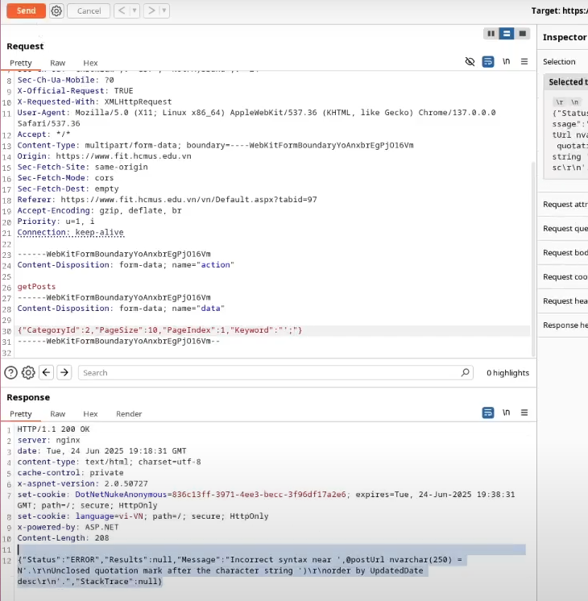
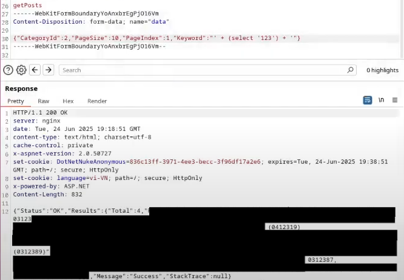
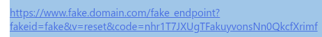

# [Write-up] How I successfully exploited the department website

## 1. Originated from a single message
One fine day, or not :), I received a message from a friend saying the department website appeared to have an **SQL injection** vulnerability, but he couldn't exploit it because the original query was quite complex.
With my long-standing dream of "hacking the university website", i fired up my laptop, launched Burp Suite and started testing.

---

## 2. The first sign
I tried the simplest payload: `'` into the search parameter, and the response was interesting:


```json
{
    "Status": "ERROR",
    "Results": null,
    "Message": "Incorrect syntax near the keyword 'Default'.\r\nUnclosed quotation mark after the character string ')\r\norder by UpdatedDate desc\r\n'.",
    "StackTrace": null
}
```

Clearly a SQL syntax error occurred. However, the message indicates the original query was fairly complex, even written across multiple lines, so using `--` to commen out the remainder might not work.

## Trying more payloads
I continued with various other payloads
| Payload                       | Response |
|-------------------------------|----------|
| `';`                          | Incorrect syntax near ',@postUrl nvarchar(250) = N'... |
| `'; -- `                      | Incorrect syntax near the keyword 'from'... |
| `' union select null`         | Incorrect syntax near the keyword 'union'... |
| `' union select null --`      | Must declare the scalar variable "@categoryId"... |

It looks like the query uses dynamic SQL in a stored procedure and contains many internal variables (`@postUrl`, `@categoryId`,...).

Also, the error messages and keywords like `nvarchar`, `@`,... reveal the system can be running Microsoft SQL Server (MSSQL).

## Breakthrough idea - using string concatenation
Because injections like `' or 1=1 -- ` were ineffective, and this is in a search function on the website, I thought about string concatenation in SQL and yes, it worked:


```json
{
    "Status": "OK",
    "Results": {"Total": 4, "Posts": [...]},
    "Message": "Success",
    "StackTrace": null
}
```

However the returned result is an array of posts containing the concatenated string, so determining that string (in queries on tables like `select name from sys.tables`) is still tricky, especially when no post contain the string. This led me to consider using `case when (select top 1 ...) like '..%' then '123' else 'zzzzz' end`, which would return the string `'123'` (non-empty search result) if `(select top 1 ...) like '..%'` is true, otherwise return `'zzzzz'` (search result is null). This allows bruteforcing values by checking whether the condition is true, though it's limited to check only the first value returned by the query.

After a few improvements, the final payload that i used to bruteforce arbitrary values i wanted:
### Example payload:
```sql
' + (case when (exists (select * from {table} where {condition}')) then '123' else 'zzzzz' end) + '
```

If the select subquery returns `'123'` (present in the post list), the condition is true. If `'zzzzz'` appears instead - the condition is false. From here, I could brute-force table names, column names, and data values... character by character (Side channel attack)

## Automating the exploit and result
I wrote 3 scripts to automate the process (If you want to get these script, please contact me)
- `brute_tables.py` - find table names in `sys.tables`
- `brute_columns.py` - find column names in `infomation_schema.columns`
- `brute_values.py` - find specific values inside tables

### Results:
- The database contains over **250 tables*, but ~50 tables is used
- There is a table holding account information: `UserAccount` (renamed for security purposes)
    - Notable columns: `username`, `email`, `name`, `resetPasswordCode`, `isAdmin`,...
    - There is 4 account which is **admin**
- `ASP.NET` identity table, having passwords properly hashed (not exploitable)
- Leaked lots of data such as: grades, student names, phone number, emails, etc...
  
## Furthermore - Account takeover vis `resetPasswordCode`
Not stopping there, the `resetPasswordCode` column made me think of the **Forgot Password** feature - which might noy be handled carefully. Testing on own account, I saw the feature sends a link to the email with a format like: ```https://www.fake.domain.com/fake_endpoint?fakeid=fake&v=reset&code=nhr1T7JXUgTFakuyvonsNn0QkcfXrimf```



I though about a popular business logic vulnerability, the resetCode cannot be hashed before saved to database. Then I compared and realized: the `code` is exactly the `resetPasswordCode` from the database, and this value is not hashed :))

I tried sending a reset request with the admin account’s code, and the admin password reset link was valid :)) Bruh

## Severity
- Disclosure of all user information, grades, internal data,...
- Unauthorized access to any account, including **admin**

## Remediation suggestions
- Using Prepared Statements / Parameterized Queries
- Donot concatenate SQL strings
- Hash all sensitive tokens (e.g resetPasswordCode)
- Deploy a WAF or abnormal access detection mechanisms

## Conclution
This is my first time doing real-world web exploitation, and the very first target happened to be the department website where I study :). I achieved one of my school-day dreams - **hacking the university's website**.

P/S: I reported the issue to the system administrators, and the vulnerability has already been patched.

---
*Write-up* by [*mortal*](https://ngtrongdoanh.github.io/portfolio/)